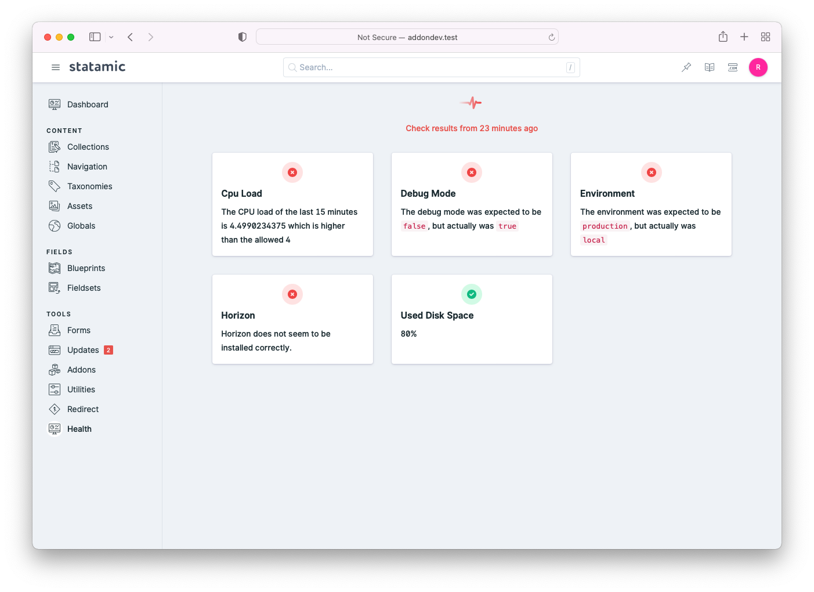

# Check the health of your Statamic app

[](https://packagist.org/packages/spatie/statamic-health)
[](https://github.com/spatie/statamic-health/actions?query=workflow%3Arun-tests+branch%3Amain)
[](https://github.com/spatie/statamic-health/actions?query=workflow%3A"Check+%26+fix+styling"+branch%3Amain)
[](https://packagist.org/packages/spatie/statamic-health)



Using this addon you can monitor the health of your application by registering checks.

Here's an example where we'll monitor available disk space.

```php
// typically, in a service provider

use Spatie\Health\Facades\Health;
use Spatie\Health\Checks\Checks\UsedDiskSpaceCheck;

Health::checks([
    UsedDiskSpaceCheck::new()
        ->warnWhenUsedSpaceIsAbovePercentage(70)
        ->failWhenUsedSpaceIsAbovePercentage(90),
]);
```

When the used disk space is over 70%, then a notification with a warning will be sent. If it's above 90%, you'll get an error notification. Out of the box, the package can notify you via mail and Slack.

## Support us

[](https://spatie.be/github-ad-click/statamic-health)

We invest a lot of resources into creating [best in class open source packages](https://spatie.be/open-source). You can support us by [buying one of our paid products](https://spatie.be/open-source/support-us).

We highly appreciate you sending us a postcard from your hometown, mentioning which of our package(s) you are using. You'll find our address on [our contact page](https://spatie.be/about-us). We publish all received postcards on [our virtual postcard wall](https://spatie.be/open-source/postcards).

## Installation

Publish the `laravel-health` config file

```shell
php artisan vendor:publish --tag="health-config"
```

Remove the `EloquentHealthResultStore` in the `health_stores` array and replace it by the following:

```php
Spatie\Health\ResultStores\JsonFileHealthResultStore::class => [
    'disk' => 'local',
    'path' => 'health.json',
],
```

This will store the result of the health checks in a json file instead of trying to access a database.

## Documentation

This addon uses the [Laravel Health](https://spatie.be/docs/laravel-health) package, for more information on the package itself check out the docs.

### Widget

This addon provides you with the possibility of adding health check widgets to your Statamic dashboard, you can add any Health check by configuring the widget in `config/statamic/cp.php` like this:

```php
'widgets' => [
    [
        'type' => 'health_check',
        'check' => \Spatie\Health\Checks\Checks\UsedDiskSpaceCheck::class,
        'width' => 33,
    ],
    ...
],
```

Make sure you've configured the Health check correctly before adding it to your dashboard.

### Disabling the Health control panel section

If you want to disable the Health section in the control panel, for example when you've added all the widgets to the Statamic dashboard instead, you can add the following config key to the Laravel health (`config/health.php`) file:

```php
'statamic' => [
    'enable_dashboard' => false,
]
```

## Testing

```bash
composer test
```

## Changelog

Please see [CHANGELOG](CHANGELOG.md) for more information on what has changed recently.

## Contributing

Please see [CONTRIBUTING](.github/CONTRIBUTING.md) for details.

## Security Vulnerabilities

Please review [our security policy](../../security/policy) on how to report security vulnerabilities.

## Credits

- [Rias Van der Veken](https://github.com/riasvdv)
- [All Contributors](../../contributors)

## License

The MIT License (MIT). Please see [License File](LICENSE.md) for more information.
